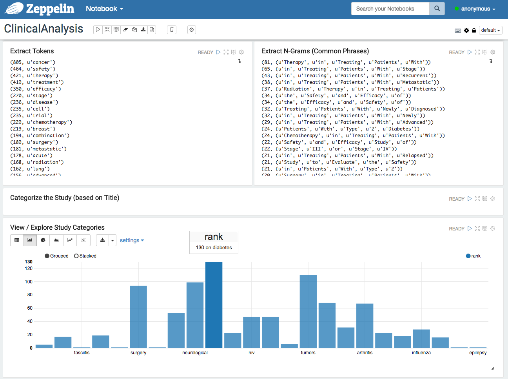
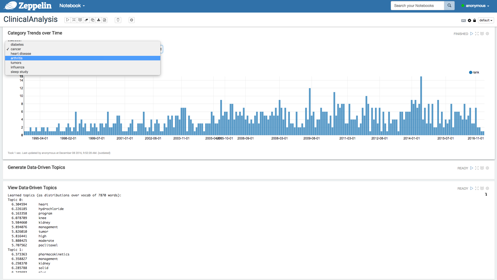

<h3>Clinical Trials Analysis</h3>
This project contains publicly available clinical trials data and the code used for the analysis of this information. I used Spark (pySpark) for my analysis and Zeppelin as the code editor & visualization tool.
 
 The purpose of this project is to provide an example of how to analyze both structured and unstructured data using Spark. This involves parsing and cleansing the raw data, text analytics (to find data-driven topics), and basic visualization techniques available within Zeppelin.
 
 <b>References:</b>
 <a href="http://hortonworks.com/downloads/#sandbox">Hortonworks HDP 2.5 Sandbox</a>
 <a href="http://spark.apache.org/docs/latest/api/python/index.html">PySpark Docs</a>
 
 
 
 
 
 
 
 
 
